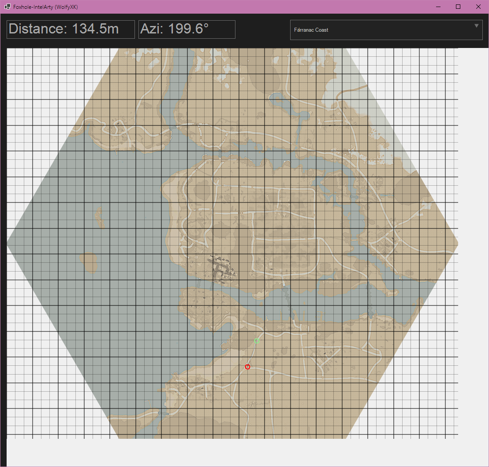

# foxhole-intelarty

Currently creating a C# winforms version of my previously abandoned project (https://github.com/wolfyxk/Foxhole-NoSpotterArty)

Description: Visual version of a foxhole artillery calculator app.

Currently has basic functionality although I have yet to verify all the maths. And I still have to do any in game testing to calibrate the azimuth correctly, so I would advise against using in game at the moment.

